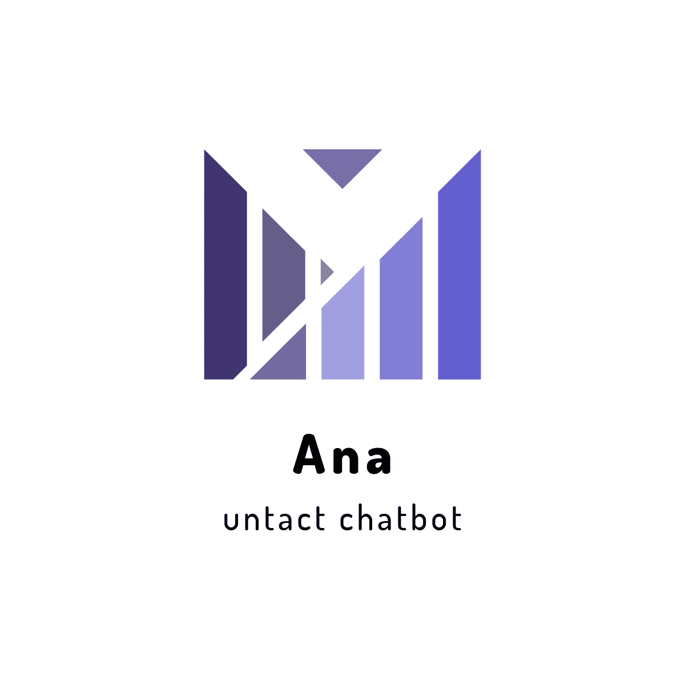

# Logo


## 팀소개 및 프로잭트 설명 동영상
국군지휘통신사령부(Republic of Korea Defense Communication Command) 소속 병사 두명으로 구성됨.


## 기능 설계
 -  발사믹, 카카오 오븐 등 본인이 편한 목업 프레임워크를 이용하여 제작 후 링크 
 - 수기로 작성시 찍어서 올려주세요

## 컴퓨터 구성 / 필수 조건 안내 (Prerequisites)
* Browser : ECMAScript 6 support

## 기술 스택 (Technique Used) (예시)
### Server(back-end)
 - server language : 
 - framework : 
 - DB :
 
### front-end

 -  react.js

## 설치 안내 (Installation Process)
```bash
$ git clone https://github.com/osamhack2020/Cloud_UntactCounsel_Ana.git
```

## 프로젝트 사용법 (Getting Started)

1. Branch Organization
    - Submit all changes directly to the master branch. We don’t use separate branches for development or for upcoming releases. We do our best to keep master in good shape, with all tests passing.
2. Bugs
    - We are using GitHub Issues for our public bugs. We keep a close eye on this and try to make it clear when we have an internal fix in progress. Before filing a new task, try to make sure your problem doesn’t already exist.
3. Proposing a Change
    - If you intend to change the public API, or make any non-trivial changes to the implementation, we recommend filing an issue. This lets us reach an agreement on your proposal before you put significant effort into it.
    - If you’re only fixing a bug, it’s fine to submit a pull request right away but we still recommend to file an issue detailing what you’re fixing. This is helpful in case we don’t accept that specific fix but want to keep track of the issue.


## 팀 정보 (Team Information)
- son min woo (mwson987@gmail.com), [Github](https://github.com/SonMinWoo)
- lee hyeong chang (hc9904@hanyang.ac.kr), [Github](https://github.com/AnOldStory)

## 저작권 및 사용권 정보 (Copyleft / End User License)
 * [MIT](https://github.com/osamhack2020/Cloud_UntactCounsel_Ana/blob/master/license)
